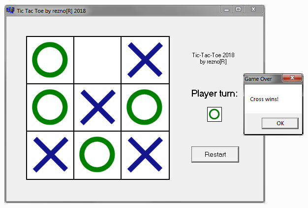

# Learning Object C++ - Windows Builder Tic Tac Toe
> Training course - Pasja Informatyki, Object C++ course, episode 9 ( [Link](https://www.youtube.com/watch?v=vd0zDG4vwOw) )

## General info
Windows GUI game written in C++ Builder 6.0. It's a simple Tic-Tac-Toe game with a 3x3 field and a restart option.

## Technologies
* C++
* C++ Builder 6.0 (IDE)

## Screenshots

## Contact
[ReznoRMichael](https://github.com/ReznoRMichael)